<pre>
task-1,Categories jadval barcha ustun ma’lumotlarini bilan qaytaring.

javob:
'''sql
SELECT * FROM categories
'''
</pre>

<pre>
task-2,Categories jadval category_name va description ustun ma’lumotlarini qaytaring.
javob:
'''sql
SELECT category_name, description from categories
'''
</pre>
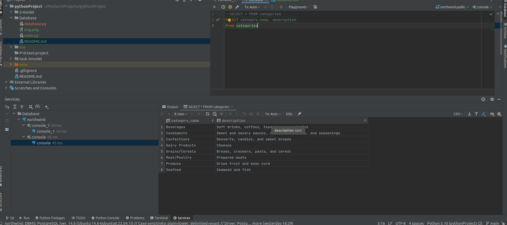
<pre>
task-3,Categories jadval barcha ustun ma’lumotlari olishda ustun nomlarini o’zbekcha tarjimada
qaytaring. M-n: category_name=Nomi
javob:
'''sql
SELECT category_id AS kategoriya_id, category_name AS kategoriya_nomi, description AS Tavsifi, picture AS Rasm
FROM categories
'''
</pre>

<pre>
task-4 Categories jadvaldan kategoriya nomi ’Confections’ ga teng bo’lgan ma’lumotlarni
qaytaring.
javob:
'''sql
SELECT * FROM categories WHERE category_name= 'Confections'
'''
</pre>
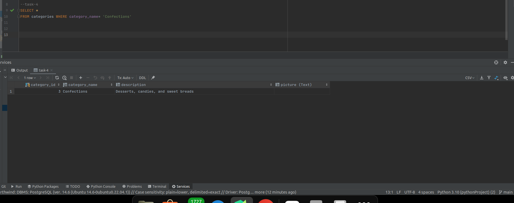
<pre>
task-5 Categories jadvaldan kategoriya nomi ‘Produce’ yoki ‘Seafood’ bo’lgan ma’lumotlarni
qaytaring.
javob:
'''sql
SELECT * FROM categories WHERE category_name = 'Produce' OR category_name = 'Seafood'
'''
</pre>
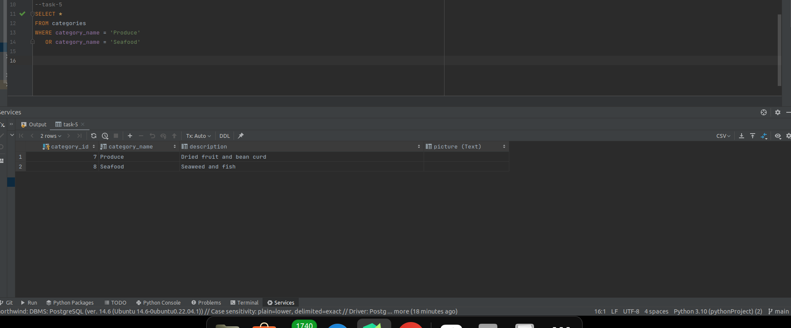
<pre>
TASK-6
</pre>

<pre>
javob:
'''sql
SELECT * FROM categories WHERE category_id BETWEEN 6 AND 8
'''
</pre>
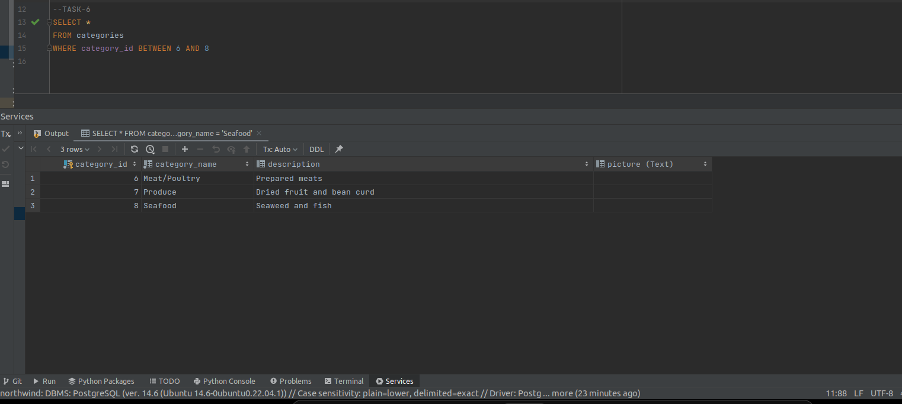
<pre>
TASK-7,Categories jadvaldan ma’lumotlarni description alifbo bo’yicha Z-A tartibida chiqaring.
javob:
'''sql
SELECT *
from categories
order by description desc
'''
</pre>
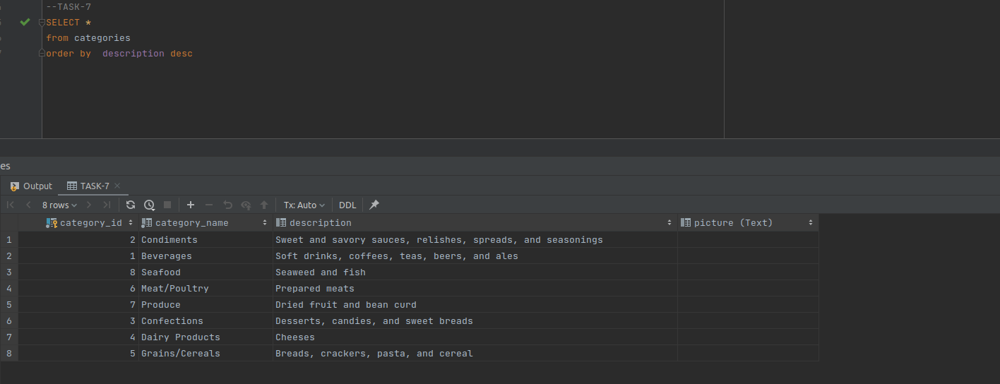
<pre>
TASK-8, Customers jadvalidan barcha ma’lumotlarni oling
javob:
'''sql
SELECT * from customers
'''
</pre>
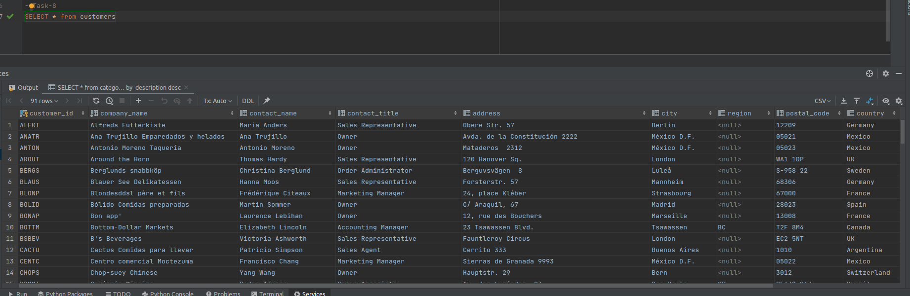
<pre>
TASK-9,Customers jadvalida ustun nomlarini o’zbekcha holatda oling
javob:
'''sql
SELECT customer_id AS mijoz_id,
company_name AS kompanina_nomi,
contact_name AS mijoz_nomi,
contact_title as mijoz_unvon,
address as manzil,
city as shahar,
region as viloyat,
postal_code as poshta_kodi,
country as mamlakat_nomi,
phone as telefon_raqami,
fax as faks
from customers
'''
</pre>

<pre>
#TASK-10, Customers jadvalidan contact_title ‘Owner’ bo’lgan ma’lumotlarni qaytaring.
javob:
'''sql
SELECT *
FROM customers
WHERE contact_title = 'Owner'
'''
</pre>

<pre>
#TASK-11,Customers jadvalidan city ‘London’ bo’lgan ma’lumotlarni qaytaring.
javob:
'''sql

SELECT *
FROM customers
WHERE city = 'London'
'''
</pre>

<pre>
#TASK-12,Customers jadvalidan region ustun NULL bo’lgan ma’lumotlarni qaytaring
javob:
'''sql
SELECT *
FROM customers
WHERE region is null
'''
</pre>
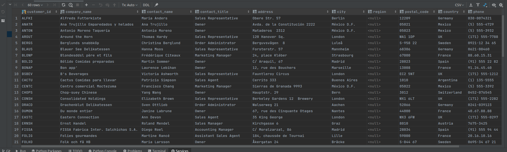
<pre>
#TASK-13,Customers jadvalidan region ustun NULL bo’lmagan ma’lumotlarni qaytaring.
javob:
'''sql
SELECT *
FROM customers
WHERE region is not null
'''
</pre>

<pre>
#TASK-14,Customers jadvalidan country ustun Germany bo’lgan ma’lumotlarni qaytaring.
javob:
'''sql
SELECT *
FROM customers
WHERE country ='Germany'
'''
</pre>
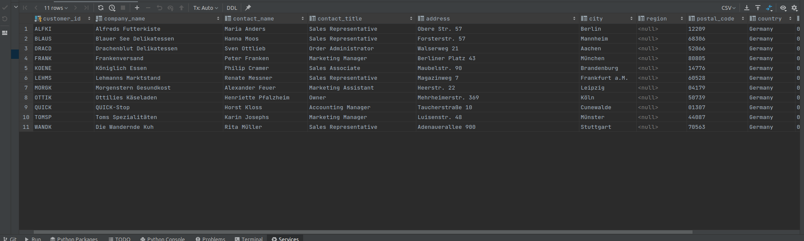
<pre>
#TASK-15,Customers jadvalidan country ustun Germany bo’lgan qatorlar sonini qaytaring.
javob:
'''sql
SELECT count(*)
FROM customers
WHERE country = 'Germany'
'''
</pre>

<pre>
#Task-16, Customers jadvalidan fax ustun NULL bo’lmalgan ma’lumotlarni contact_name ustun
alifbo tartiba tartiblab qaytaring.
javob:
'''sql
SELECT *
FROM customers
WHERE (fax is not null)
order by contact_name
'''
</pre>

<pre>
#Task-17,Employees jadvaldan barcha ma’lumotlarni qaytaring.
javob:
'''sql
SELECT * FROM employees
'''
</pre>

<pre>
#Task-18,Employees jadval ustun nomlarini o’zbekcha qaytaring.
javob:
'''sql
SELECT employee_id as xodim_id,
last_name as familya,
first_name as ism,
title as unvon,
title_of_courtesy as unvon_boyicha_hurmati,
birth_date as tugilgan_malumotlar,
hire_date as ish_boshlagan_kun,
address as manzil,
city as shahar,
region as viloyat,
postal_code as pochta_kodi,
country as mamlakati,
home_phone as uy_telefon_raqami,
extension as kengaytma,
photo as rasm,
notes as malumot
FROM employees
'''
</pre>
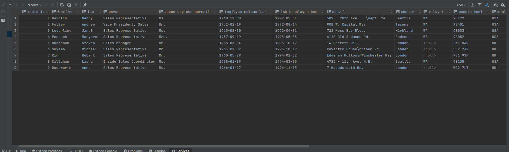
<pre>
#TAsk-19,Employess jadvaldan title_of_courtest ‘Mr’ bo’lgan xodimlarni firts_name alifbo tartibida
qaytaring.
javob:
'''sql
SELECT *
FROM employees
WHERE title_of_courtesy = 'Mr.'
order by first_name
'''
</pre>
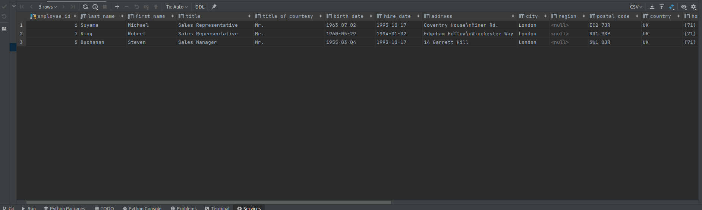
<pre>
#Task-20,Employes jadvalda title ‘Sales Representative’ bo’lgan xodimlar sonini qaytaring
javob:
'''sql
SELECT * FROM employees where title='Sales Representative'
'''
</pre>
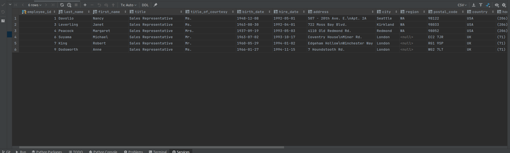
<pre>
#Task-21,Employees jadvalda hire_date 1994-yilda bo’lgan ma’lumotlarni qaytaring.
javob:
'''sql
SELECT *
FROM employees
where hire_date between '1994-01-01' and '1994-12-31'
'''
</pre>

<pre>
#Task-22,Employees jadvaldan region NULL bo’lmagan xodimlarni first_name, last_name, title, city,
home_phone ma’lumotlarini first_name Z-A alifbo tartibida qaytaring.
javob:
'''sql
SELECT first_name, last_name, title, city, home_phone
FROM employees
WHERE region IS not NULL
order by first_name
'''
</pre>

<pre>
#Task-23,Orders jadvaldan customer_id ‘VINET’ bo’lgan buyurtmalarni qaytaring
javob:
'''sql
SELECT *
FROM orders
WHERE customer_id = 'VINET'
'''
</pre>

<pre>
#Task-24,Orders jadvaldan order_date ustuni orqali 1996-yildagi ma’lumotlarni qaytaring
javob:
'''sql
SELECT *
FROM orders
WHERE order_date between '1996-01-01'and '1996-12-31'
'''
</pre>
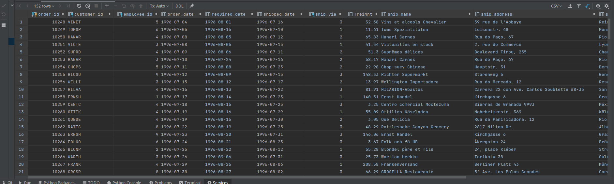
<pre>
#Task-25,Orders jadvaldan ship_region ustun NULL bo’lmagan ma’lumotlarni qaytaring.
javob:
'''sql
SELECT *
FROM orders
WHERE ship_region is not null
'''
</pre>

<pre>
#Task-26,Orders jadvaldan order_id 10300 va 10400 orasida bo’lgan ma’lumotlarni qaytaring
javob:
'''sql
SELECT *
FROM orders
WHERE order_id between '10300' and '10400'
'''
</pre>
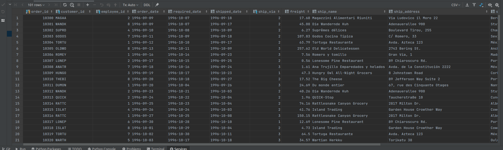

<pre>
#Task-27, Order Details jadvaldan unit_price ustun umumiy qiymatini qaytaring.
javob:
'''sql
SELECT count(unit_price)
FROM order_details
'''
</pre>

