## task 1

```sql
SELECT *
FROM salesman
```

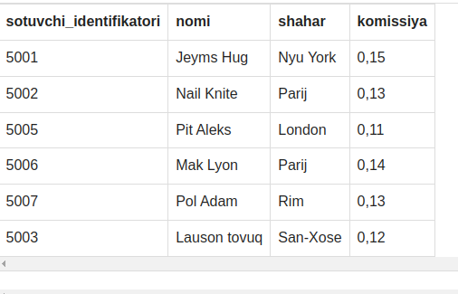

# task 2

```sql
SELECT 'This is SQL Exercise, Practice and Solution'
```

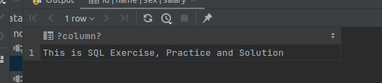

# TASK 3

```sql
SELECT 5, 10, 15
```

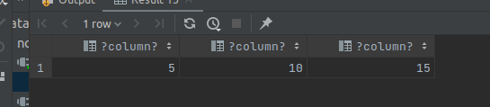

# task 4

```sql
SELECT 15 + 10;
```


# task 5

```sql
SELECT 10 + 15 / 3;
```

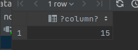

# task 6

```sql
SELECT name, commission
from salesman;
```

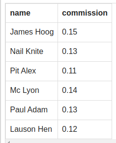

# TASK 7

```sql
SELECT ord_date, salesman_id, ord_no, purch_amt, customer_id
from orders

```

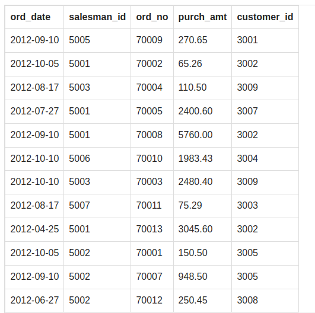

# TASK 8

```sql
SELECT DISTINCT salesman_id
FROM orders
ORDER BY salesman_id;
```

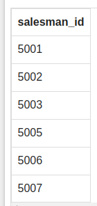

# TASK 9

```sql
SELECT name, city
FROM salesman
where city = 'Paris';
```

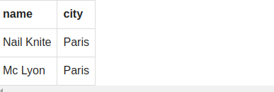

# TASK 10

```sql
SELECT customer_id, cust_name, city, grade, salesman_id
FROM customer
where grade = 200;
```

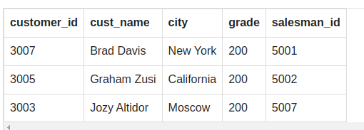

# TASK 11

```sql
SELECT ord_no, ord_date, purch_amt
from orders
where salesman_id = 5001;
```

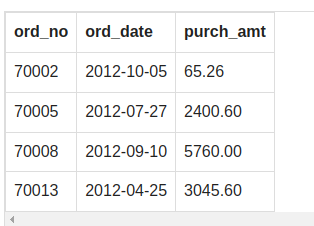

# TASK 12

```sql
SELECT year, subject, winner
from nobel_win
where year = 1970;
```

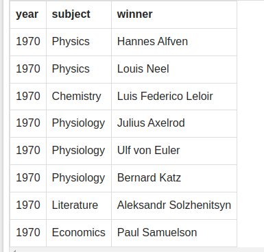

# TASK 13

```sql
SELECT year, subject, winner
from nobel_win
where year = 1970 and subject = 'Literature';
```

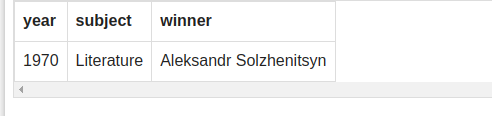

# TASK 14

```sql
SELECT year, subject
from nobel_win
where winner = 'Dennis Gabor';
```

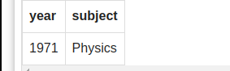

# TASK 15

```sql
SELECT winner
from nobel_win
where year >= 1950 and subject = 'Physics';
```

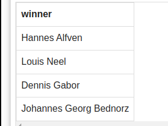

# TASK 16

```sql
SELECT year, subject, winner, country
from nobel_win
where year between 1965 and 1975 and subject = 'Chemistry'
```

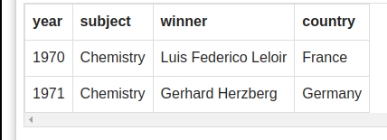

# TASK 17

```sql
SELECT *
from nobel_win
where year > 1972 and winner = 'Menachem Begin' or winner = 'Yitzhak Rabin';
```

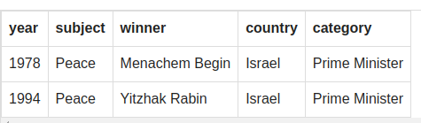

# TASK 18

```sql
select year, subject, winner, country, category
from nobel_win
where winner like 'Louis%'
```

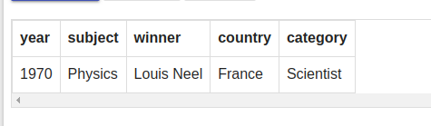

# TASK 20

```sql
select year, subject, winner, country, category
from nobel_win
where subject <> 'Physiology' and subject <> 'Economics' 
```

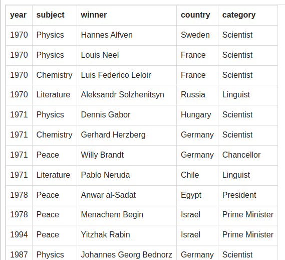

# TASK 21

```sql
select year, subject, winner, country, category
from nobel_win
where (year <= 1971 and subject= 'Physiology')
UNION
(
select *
from nobel_win
where year >= 1974 and subject = 'Peace')
```

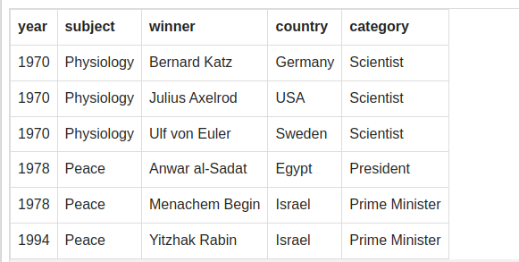

# TASK 22

```sql
select year, subject, winner, country, category
from nobel_win
where winner = 'Johannes Georg Bednorz'
```

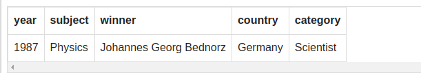

# TASK 23

```sql
select *
from nobel_win
where subject not ilike 'p%'
order by year desc, winner
```

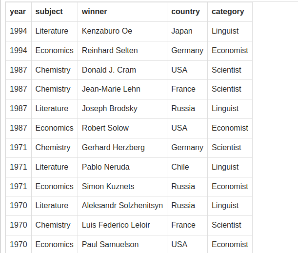

# TASK 24

```sql
SELECT *
FROM nobel_win
WHERE year =1970
ORDER BY
    CASE
    WHEN subject IN ('Economics', 'Chemistry') THEN 1
    ELSE 0
END
ASC,
 subject,
 winner;
```

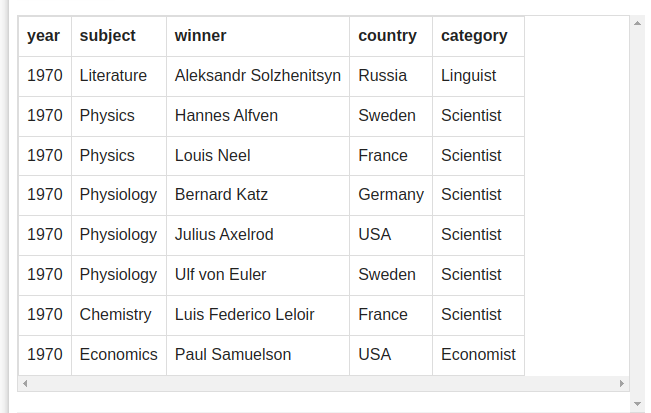

# TASK 25

```sql
SELECT *
FROM item_mast
where pro_price between 200 and 600
```

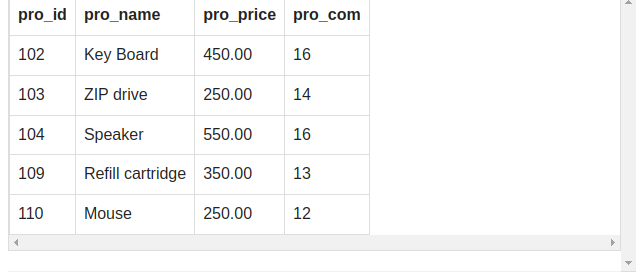

# TASK 26

```sql
SELECT avg(pro_price)
FROM item_mast
where pro_com = 16;
```

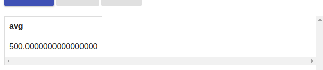

# TASK 27

```sql
 SELECT pro_name as "Item Name", pro_price AS "Price in Rs."
 FROM item_mast;
```

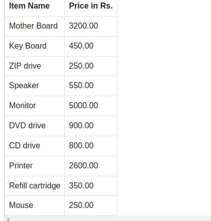

# TASK 28

```sql
 SELECT pro_name, pro_price
 FROM item_mast
 where pro_price >= 250
 order by pro_price desc, pro_name;
```

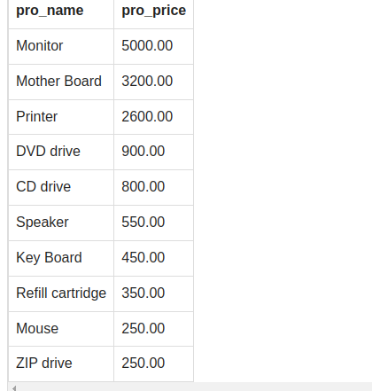

# TASK 29

```sql
SELECT avg(pro_price), pro_com
FROM item_mast
group by pro_com 
```

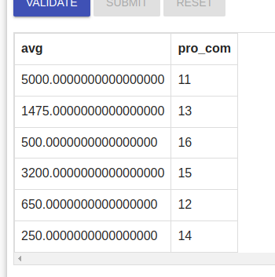

# TASK 30

```sql
SELECT pro_name, pro_price
FROM item_mast
where pro_price = (select min(pro_price) from item_mast)
```

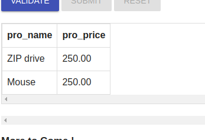

# TASK 31

```sql
SELECT DISTINCT emp_lname
FROM emp_details;

```

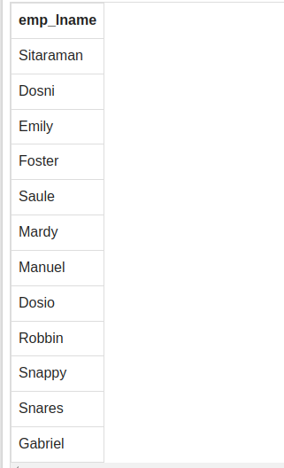

# TASK 32

```sql
SELECT *
FROM emp_details
where emp_lname = 'Snares';
```

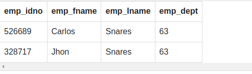

# TASK 33

```sql
SELECT *
FROM emp_details
where emp_dept = 57;
```

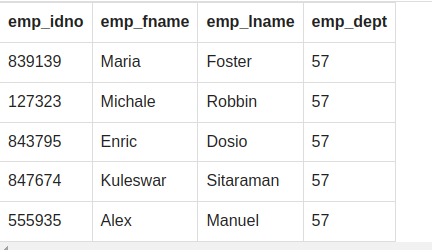