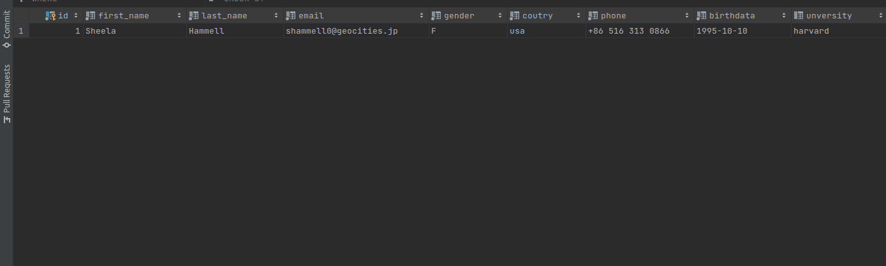
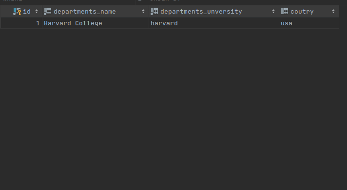
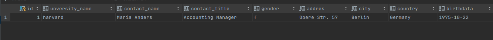

# TASK studens
```sql
create table studens
(
    id         serial      not null primary key,
    first_name VARCHAR(50) not null,
    last_name  VARCHAR(50) not null,
    email      VARCHAR(50) not null,
    gender     VARCHAR(50) not null,
    coutry     VARCHAR(50) not null,
    phone      VARCHAR(50) not null,
    birthdata  date        not null,
    unversity  varchar(60)

);
insert into studens (first_name, last_name, email, gender, coutry, phone, birthdata, unversity)
values ('Sheela', 'Hammell', 'shammell0@geocities.jp', 'F', 'usa', '+86 516 313 0866', '1995.10.10', 'harvard');

```



# TASK departments
```sql
create table departments
(
    id                    serial      not null primary key,
    departments_name      varchar(60) not null,
    departments_unversity varchar(60) not null,
    coutry                varchar(60)

);
insert into departments(departments_name, departments_unversity, coutry)
values ('Harvard College', 'harvard', 'usa')
```


# TASK Staffs 
```sql
create table staffs
(
    id             serial      not null primary key,
    unversity_name VARCHAR(50) not null,
    contact_name   VARCHAR(50) not null,
    contact_title  VARCHAR(50) not null,
    gender         VARCHAR(50) not null,
    addres         VARCHAR(50) not null,
    city           VARCHAR(50) not null,
    country        varchar(60),
    birthdata      date        not null
);

insert into staffs(unversity_name, contact_name, contact_title, gender, addres, city, country, birthdata)
values ('harvard','Maria Anders','Accounting Manager','f','Obere Str. 57','Berlin','Germany','1975.10.22')

```


# TASK Teacher
```sql
create table teacher
(
    id               serial      not null primary key,
    first_name       VARCHAR(50) not null,
    last_name        VARCHAR(50) not null,
    birthday         date        not null,
    unversity        varchar(60) not null,
    phone            varchar(60) not null,
    position_teacher varchar(60) not null

);
insert into teacher(first_name, last_name, birthday, unversity, phone, position_teacher)
values ('Alex', 'Ivanovich', '1982.02.3', 'harvard', '+7 981-565-65-65', '
Russian language teacher')

```


# TASK Groups
```sql
create table groups
(
    id                serial      not null primary key,
    groups_name       varchar(60) not null,
    groups_unverscity varchar(60) not null,
    groups_city       varchar(60) not null,
    groups_country    varchar(60) not null
);
insert into groups(groups_name, groups_unverscity, groups_city, groups_country)
values ('python', 'harvard', 'new york', 'usa');

```


# TASK Subjects
```sql
create table subjects
(
    id                    serial      not null primary key,
    subjects_name         varchar(60) not null,
    unverscity_name       varchar(60) not null,
    start_of_class        varchar(5)  not null,
    the_end_of_the_lesson varchar(5)  not null
);
insert into subjects(subjects_name, unverscity_name, start_of_class, the_end_of_the_lesson)
values ('physics', 'harvard', '15.00', '18.00');

```


# TASK Regions
```sql
create table regions
(
    id      serial      not null primary key,
    coutry  varchar(60) not null,
    city    varchar(60) not null,
    regions varchar(60) not null

);
insert into regions(coutry, city, regions) values ('usa','new york','Central New York')
```
