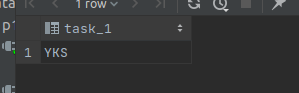

# Task 1

```sql
create or replace function task_1(a varchar)
    returns text
    language plpgsql
as
$$
declare
    ttotal_amount varchar;
begin
    select model::json ->> a
    into ttotal_amount
    from aircrafts_data;
    return ttotal_amount;
end;
$$;


select task_1('en');
select task_1('ru');
```

# en

,

# ru

,

# Task 2

```sql
create or replace function task_1(a text)
    returns text
    language plpgsql
as
$$
declare
    ttotal_amount varchar;
begin
    select airport_code, airport_name, airport_code, airport_name, city, coordinates, timezone
    into ttotal_amount
    from airports_data
    where timezone = a;
    return ttotal_amount;
end;
$$;


select task_1('Asia/Yakutsk');
```

<

# TASK 3 
```sql
create or replace function task_3(a varchar)
    returns text
    language plpgsql
as
$$
declare
    ttotal_amount varchar;
begin
    select city::json ->> a
    into ttotal_amount
    from airports_data;
    return upper(ttotal_amount);
end;
$$;


select task_3('en');
select task_3('ru');
```
# en

,

# ru

,